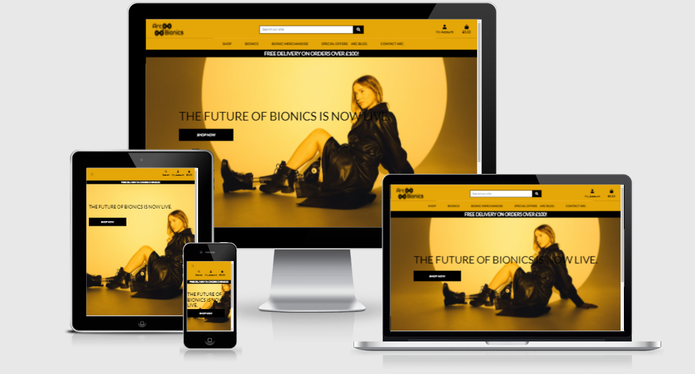
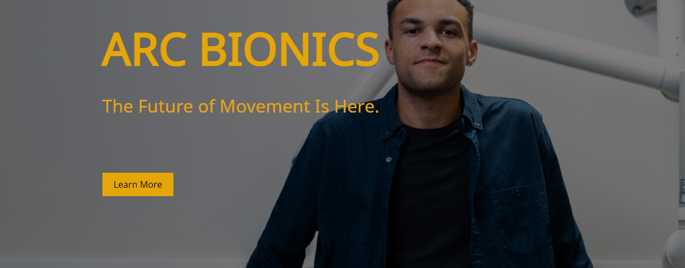
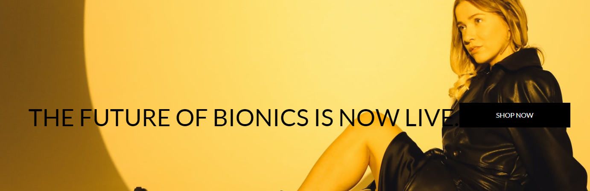
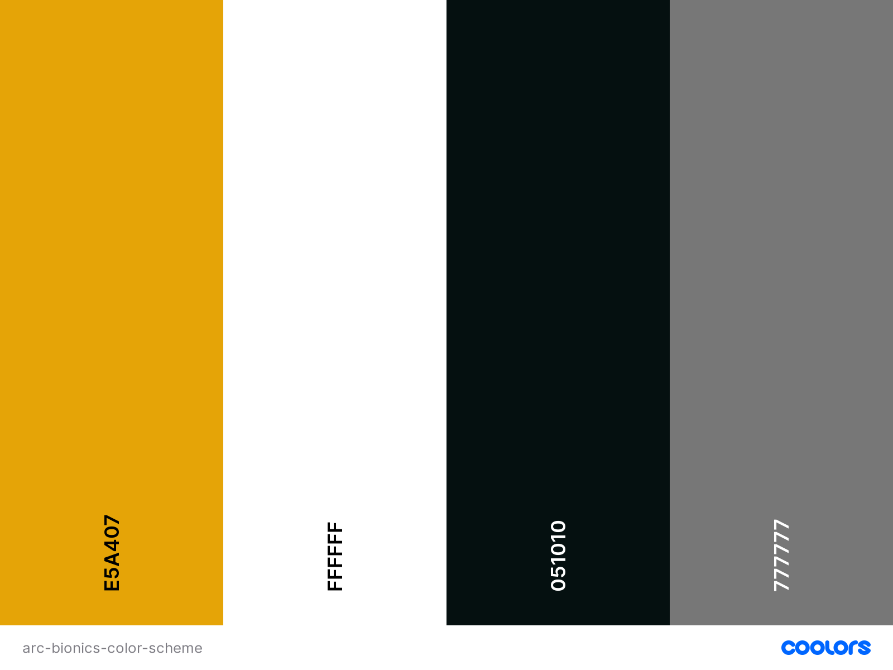

<h1 align="center">Arc Bionics</h1>

<h2 align="center"></h2>

# Table of Contents 

1. [Project Introduction](#introduction)
2. [UX](#ux)
3. [Design Choices](#designchoices)
4. [Wireframes](#wireframes)
5. [Features](#features)
6. [Technologies Used](#techused)
7. [Testing](#testing)
8. [Deployment](#deployment)
9. [Credits](#credits)
10. [Acknowledgements](#acknowledgements)
11. [Disclaimer](#disclaimer)

## Project Scope 

This is my 4th and final milestone project to becoming a Full Stack Developer with the grace help of Code Institute. The project i have created here is an extension of my first
milestone project which had the same theme. Where that had the basic framework of HTML/CSS, this is a full extension of that which houses my shown skills in Django, Python and various other technologies. The main scope for this website is centered around Bionics, Prosthetics catered for Amputees. This idea of a website had drove my passion to make this the best I can make it, as I have family members who are amputees, thus giving me the motivation to seeing this through and seeing what I could create.

My aim with this project was to showcase what bionics are available for amputees and to show that there are possibilities to allow them to feel normal again through their use of the bionics limbs. It also displays what kind of help is available through means of connecting with other amputees and giving them the satisfaction that it is affordable.

This application uses a full e-commerce functionality and the payments are made from Stripe. This application also contains a blog section for the store owner to illustrate to the users what they can expect from this and also to answer any questions people may have. The blog section is completely interactive allowing users to leave comments and converse. A contact model is also implemented for ease of access, allowing users to send real time emails to the store owner in which they will be alerted and will be able to see the contents of it through the admin panel.

As certain features cannot be accessed as a normal user, I have taken the liberty to include an admin login details in the comments portion of the stage upon submitting the project.

## Please Read

*This project and the content involved was developed for educational purposes only. Please do not enter any real credit card information upon checkout.*

*Instead, please use this card number for testing purposes*

*Stripe Card Number: 4242 4242 4242 4242*

*Add any end date for the card as you please*

*Add any CVV number of your choice*

To view my live project, please click on the link below. I hope you enjoy!

[View my Live Project Here!](https://arc-bionics-final.herokuapp.com/)

# User Experience (UX) 

### User Stories

   - As a user I want to be able to view the products the website has to offer
   - As a user I want to be able to navigate the website with ease
   - As a user I want to have the means to contact the company
   - As a user I would like to search for a product using the search function
   - As a user I want to be able to browse each product's categories
   - As a user I want to be given the ability to edit my shopping bag
   - As a user I want to be able to checkout with ease 
   - As a user I want to be able to see my order details and personal details

### Site Owner Stories 

   - As a site owner, I want to be able to edit, add and delete products
   - As a site owner, I want to customers to have a pain free browsing experience
   - As a site owner, I want the website to be completely responsive
   - As a site owner, I want to be able to view the admin panel to make necessary changes

# Design Choices 

## Font Selection & Theme

   Due to this project being an extension of my MS1 and having close links and keeping the design scheme the same, I had used the same font that was present in my first project and had carried it over to this to maintain the theme.

   The font I had chosen in the end was [Lato](https://fonts.google.com/specimen/Lato)
    
    
<h2 align="left"></h2>

<h2 align="right"></h2>

As shown above, the font is clearly the same just with added bold effects. This is also a good time to actually notice the similarity in themes from my first project to my latest. Both keep their respective themes and I feel like as a site owner, I should have the ability to maintain the design scheme throughout to ensure it is consistent so returning users can also navigate their way around upon browsing the website.

## Color Choices

When considering the colour theme for my website in the pre planning phase, I had already knew I was going to use the same colour palette from my first project as i wanted to maintain the theme and the design of the website so it is consistent overall and across all pages.

The images and the colour of the text as well as the colours used contrasted well and worked well together and there were no hard to see elements when taking the colour into account

<h2 align="center"></h2>

## Wireframes 

Wireframes for this project were developed and planned in [Balsamiq](https://balsamiq.com).
There are no huge marginal changes when comparing them to the live website. Both the live and the wireframes feature the same design respectively whilst keeping the original scope in mind. There are no massive changes that affect the usability of the website.

Wireframes for my project can be found [here](documentation/wireframes/ms4-wireframes1.pdf)

## Features 

- A e-commerce website with full usability to search products through categories and tags.

- Responsive on desktop as well as for handheld devices when on the go.

- A dedicated admin panel product management page to alter products and to also add new products

- A complete working interactive search function to narrow down products as well as sorting from price, name and category ascending order.

- Full CRUD Functionality implemented.

- A complete working blog with ability to add comments as users with a moderated view.

- A contacts model to get in touch directly with the store owner.

## Future Features to Implement

- A wishlist model to allow users to add products to their wishlist if they wish to purchase at a later date

- A reviews model to allow users to leave reviews for their favourite products

- A view to allow users to navigate from the first project through this one so they know where it all started.

## Technologies Used 

### Languages Used

- [HTML 5](https://developer.mozilla.org/en-US/docs/Web/Guide/HTML/HTML5).
    - Used within the website as the main programming language to implement the text and the structure.

 - [CSS 3](https://developer.mozilla.org/en-US/docs/Web/CSS)
    - Used to style the elements and variables contained within the website, mainly the cards, font, colour as well as
        added animations and transitions.
    
 - [JavaScript](https://developer.mozilla.org/en-US/docs/Web/JavaScript)
    - Used JS to implement the code to bring the webite together through functions used in animations, overlay and to make the site interactive.
    
 - [Python](https://www.python.org/)
    - Python programming was used to allow me to integrate the systems together seamlessly.

 - [Django](https://www.djangoproject.com/)
    - Django programming that was used to create the project

 - [Django Countries](https://pypi.org/project/django-countries/)
    - Django Countries was used to allow users to select countries in the checkout/order form.

 - [Django-Allauth](https://django-allauth.readthedocs.io/en/latest/installation.html)
    - Django Allauth was used to create and implement the sign in and register functionality for my project.

## Frameworks, Programs, Libraries and Tools Used.

 1. [Google Fonts](https://fonts.google.com)
        - Google Fonts Website was used to import the 'Spectral SC' font into the CSS file to be used within
        the game.
    2.  [Git](https://git-scm.com/)
        - Git was used for version control by using the gitpod terminal to commit, add and push changes for my project to Github.
    3.  [GitHub](https://github.com)
        - GitHub was used to store the code from the project after it was pushed via Git.
    4.  [Balsamiq](https://balsamiq.com/)
        - Balsamiq was used to create the wireframes during the design and initial process.
    5.  [HTML Formatter](https://www.freeformatter.com/html-formatter.html)
        - HTML Formatting tool was used to beautify and indent the HTML Code for the game.
    6.  [CSS Formatter](https://www.freeformatter.com/css-beautifier.html)
        - CSS Formatting tool was used to correctly indent and format the CSS within the style.css file.
    7.  [jQuery](https://jquery.com/)
        - jQuery library was used to make HTML and the JS much easier to use and implement via their API.
            This made implementing event handling, animations and manipulating much easier.
    8.  [Heroku](https://signup.heroku.com/)
        - Heroku was used to deploy my project onto the site to host it.
    9.  [AWS](https://aws.amazon.com/)
        - AWS Was used to store my static images and files onto the website through a bucket
    10. [Gunicorn](https://gunicorn.org/)
        - Gunicorn also helped allow me to deploy the site to heroku using a configuration

## Testing 