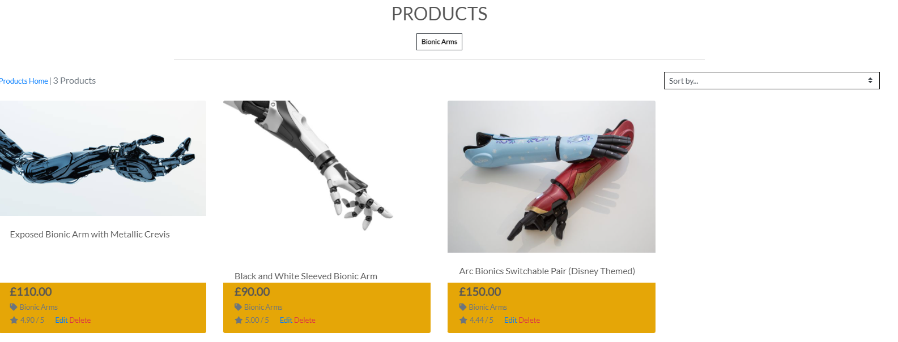

<h1 align="center">Arc Bionics</h1>

<h2 align="center"></h2>

# Table of Contents 

1. [Project Introduction](#introduction)
2. [UX](#ux)
3. [Design Choices](#designchoices)
4. [Wireframes](#wireframes)
5. [Features](#features)
6. [Technologies Used](#techused)
7. [Testing](#testing)
8. [Deployment](#deployment)
9. [Credits](#credits)
10. [Acknowledgements](#acknowledgements)
11. [Disclaimer](#disclaimer)

## Project Scope 

This is my 4th and final milestone project to becoming a Full Stack Developer with the grace help of Code Institute. The project i have created here is an extension of my first
milestone project which had the same theme. Where that had the basic framework of HTML/CSS, this is a full extension of that which houses my shown skills in Django, Python and various other technologies. The main scope for this website is centered around Bionics, Prosthetics catered for Amputees. This idea of a website had drove my passion to make this the best I can make it, as I have family members who are amputees, thus giving me the motivation to seeing this through and seeing what I could create.

My aim with this project was to showcase what bionics are available for amputees and to show that there are possibilities to allow them to feel normal again through their use of the bionics limbs. It also displays what kind of help is available through means of connecting with other amputees and giving them the satisfaction that it is affordable.

This application uses a full e-commerce functionality and the payments are made from Stripe. This application also contains a blog section for the store owner to illustrate to the users what they can expect from this and also to answer any questions people may have. The blog section is completely interactive allowing users to leave comments and converse. A contact model is also implemented for ease of access, allowing users to send real time emails to the store owner in which they will be alerted and will be able to see the contents of it through the admin panel.

As certain features cannot be accessed as a normal user, I have taken the liberty to include an admin login details in the comments portion of the stage upon submitting the project.

## Please Read

*This project and the content involved was developed for educational purposes only. Please do not enter any real credit card information upon checkout.*

*Instead, please use this card number for testing purposes*

*Stripe Card Number: 4242 4242 4242 4242*

*Add any end date for the card as you please*

*Add any CVV number of your choice*

To view my live project, please click on the link below. I hope you enjoy!

[View my Live Project Here!](https://arc-bionics-final.herokuapp.com/)

# User Experience (UX) 

### User Stories

   - As a user I want to be able to view the products the website has to offer
   - As a user I want to be able to navigate the website with ease
   - As a user I want to have the means to contact the company
   - As a user I would like to search for a product using the search function
   - As a user I want to be able to browse each product's categories
   - As a user I want to be given the ability to edit my shopping bag
   - As a user I want to be able to checkout with ease 
   - As a user I want to be able to see my order details and personal details

### Site Owner Stories 

   - As a site owner, I want to be able to edit, add and delete products
   - As a site owner, I want to customers to have a pain free browsing experience
   - As a site owner, I want the website to be completely responsive
   - As a site owner, I want to be able to view the admin panel to make necessary changes

# Design Choices 

## Font Selection & Theme

   Due to this project being an extension of my MS1 and having close links and keeping the design scheme the same, I had used the same font that was present in my first project and had carried it over to this to maintain the theme.

   The font I had chosen in the end was [Lato](https://fonts.google.com/specimen/Lato)
    
    
<h2 align="left"></h2>

<h2 align="right"></h2>

As shown above, the font is clearly the same just with added bold effects. This is also a good time to actually notice the similarity in themes from my first project to my latest. Both keep their respective themes and I feel like as a site owner, I should have the ability to maintain the design scheme throughout to ensure it is consistent so returning users can also navigate their way around upon browsing the website.

## Color Choices

When considering the colour theme for my website in the pre planning phase, I had already knew I was going to use the same colour palette from my first project as i wanted to maintain the theme and the design of the website so it is consistent overall and across all pages.

The images and the colour of the text as well as the colours used contrasted well and worked well together and there were no hard to see elements when taking the colour into account

<h2 align="center"></h2>

## Wireframes 

Wireframes for this project were developed and planned in [Balsamiq](https://balsamiq.com).
There are no huge marginal changes when comparing them to the live website. Both the live and the wireframes feature the same design respectively whilst keeping the original scope in mind. There are no massive changes that affect the usability of the website.

Wireframes for my project can be found [here](documentation/wireframes/ms4-wireframes1.pdf)

## Features 

- A e-commerce website with full usability to search products through categories and tags.

- Responsive on desktop as well as for handheld devices when on the go.

- A dedicated admin panel product management page to alter products and to also add new products

- A complete working interactive search function to narrow down products as well as sorting from price, name and category ascending order.

- Full CRUD Functionality implemented.

- A complete working blog with ability to add comments as users with a moderated view.

- A contacts model to get in touch directly with the store owner.

## Future Features to Implement

- A wishlist model to allow users to add products to their wishlist if they wish to purchase at a later date

- A reviews model to allow users to leave reviews for their favourite products

- A view to allow users to navigate from the first project through this one so they know where it all started.

## Technologies Used 

### Languages Used

- [HTML 5](https://developer.mozilla.org/en-US/docs/Web/Guide/HTML/HTML5).
    - Used within the website as the main programming language to implement the text and the structure.

 - [CSS 3](https://developer.mozilla.org/en-US/docs/Web/CSS)
    - Used to style the elements and variables contained within the website, mainly the cards, font, colour as well as
        added animations and transitions.
    
 - [JavaScript](https://developer.mozilla.org/en-US/docs/Web/JavaScript)
    - Used JS to implement the code to bring the webite together through functions used in animations, overlay and to make the site interactive.
    
 - [Python](https://www.python.org/)
    - Python programming was used to allow me to integrate the systems together seamlessly.

 - [Django](https://www.djangoproject.com/)
    - Django programming that was used to create the project

 - [Django Countries](https://pypi.org/project/django-countries/)
    - Django Countries was used to allow users to select countries in the checkout/order form.

 - [Django-Allauth](https://django-allauth.readthedocs.io/en/latest/installation.html)
    - Django Allauth was used to create and implement the sign in and register functionality for my project.

## Frameworks, Programs, Libraries and Tools Used.

 1. [Google Fonts](https://fonts.google.com)
    - Google Fonts Website was used to import the 'Spectral SC' font into the CSS file to be used within
        the game.
2.  [Git](https://git-scm.com/)
    - Git was used for version control by using the gitpod terminal to commit, add and push changes for my project to Github.
3.  [GitHub](https://github.com)
    - GitHub was used to store the code from the project after it was pushed via Git.
4.  [Balsamiq](https://balsamiq.com/)
    - Balsamiq was used to create the wireframes during the design and initial process.
5.  [HTML Formatter](https://www.freeformatter.com/html-formatter.html)
    - HTML Formatting tool was used to beautify and indent the HTML Code for the game.
6.  [CSS Formatter](https://www.freeformatter.com/css-beautifier.html)
    - CSS Formatting tool was used to correctly indent and format the CSS within the style.css file.
7.  [jQuery](https://jquery.com/)
    - jQuery library was used to make HTML and the JS much easier to use and implement via their API.
        This made implementing event handling, animations and manipulating much easier.
8.  [Heroku](https://signup.heroku.com/)
    - Heroku was used to deploy my project onto the site to host it.
9.  [AWS](https://aws.amazon.com/)
     - AWS Was used to store my static images and files onto the website through a bucket
10. [Gunicorn](https://gunicorn.org/)
    - Gunicorn also helped allow me to deploy the site to heroku using a configuration

## Testing 

4 tools were used to validate and test the integrity of my project.

[W3C Validator](https://jigsaw.w3.org/css-validator/#validate_by_input)
- This tool was used to validate and check the integrity of the CSS File included in my project.

[W3C Markup Validator](https://validator.w3.org/#validate_by_input)
- This tool was used to validate the HTML Files in my project and checks for any warnings and errors.

[JSHint](https://jshint.com/)
- This tool was used to validate the JavaScript file and to scan for any errors shown throughout the website.

[PEP8](http://pep8online.com/)
- This tool was used to validate the python files in my project and check for any errors.

*Some errors persisted when checking validation, but speaking to a tutor, they had stated this is perfectly normal as most the templates contain a mix of all the code to one so it is hard to adjust*

### Testing User Stories and Site Owner stories from UX Section

- "As a user I want to be able to view the products the website has to offer"

    - When a user clicks onto the products page situated at the top of the nav, they will be greeted with the entire catalog of products with added filter to sort. This makes it seamless for users to be able to see what products are available as well as their details when clicked onto it.

    <h2 align="left"></h2>
    <h2 align="right"></h2>

- "As a user I want to be able to navigate the website with ease"

    - When the user first logs onto the website or begins to browse, navigation is made easy thanks to the nav bar split into different sections, as well as a search bar to narrow their options. An scroll-to-top arrow has also been added for the users if they are at the bottom of the page. This will then bring them back to the top.

    <h2 align="left"></h2>

- "As a user I want to have the means to contact the company"

    - When a user navigates the website and they have a query about a product or just a general question in regards to the company, they can navigate to the "Contact Arc" link located in the nav bar, where they will then be prompted to fill in the required fields and will then get sent towards the admin/store owner to see and respond back to.
    This is efficient when a user has a complaint or wants to know more. This stores the email in the DB which will then notify the admin that an email has arrived.

    <h2 align="left"></h2>
    <h2 align="left"></h2>

- "As a user I would like to search for a product using the search function"

    - The search function on the website is implemented in a way that whatever key word the user enters, it will return the results containing that keyword. If a user wants to search for a specific item or if it has a specific word in it, this can be done via entering that word which will then show the results.

- "As a user I want to be able to browse each product's categories"

    - Browsing different categories makes the user's experience when navigating much easier and pain free. If a user wants to look at the bionic arms category then they'd have to click on bionics in the nav bar, it will then show the dropdown and then they'd have to click bionic arms which will then display all the products within that category with ease.

    <h2 align="left"></h2>

- "As a user I want to be given the ability to edit my shopping bag"

    - When a user adds a certain product to the shopping bag, a toast notification will notify them that it has been added. However when clicking onto the bag the user has the freedom to adjust the quantity of the item or size if it is a shirt. This will then update the bag and the user can proceed from then on.

    <h2 align="left"></h2>
    <h2 align="center"></h2>

- "As a user I want to be able to checkout with ease"

    - When a user adds a product of their desire to the bag and then navigates to checkout, they are greeted with the product information on one side as well as a form for them to fill out with their details such as address, name, email etc. At the bottom is a card payment field that houses card details to be entered in order for the transaction to go through. Once this occurs, a confirmation will appear after alerting the user that an confirmation email has been sent to them as well as providing the user with a summary of what they have ordered.

    <h2 align="left"></h2>
    <h2 align="center"></h2>

- "As a user I want to be able to see my order details and personal details"

    - Upon checking out and confirming an order, once a user navigates to their profile they will see their stored personal details as well as any orders they may have placed on the other side. This is seperated into 2 to allow users to see what they want to see, as well as giving them a prompt to update their details if needs be.

    <h2 align="left"></h2>

- "As a site owner, I want to be able to edit, add and delete products"

    - The site owner can do this if they are logged into the website. In order to edit a product or add one, they would have to navigate to the "Product Management" portion of the website when clicking on their account. In order to delete a product, they can browse the catalog and under each product there will be 2 buttons. One to edit and one to delete.

    <h2 align="left"></h2>

- "As a site owner, I want the website to be completely responsive"

    - The website contains the bootstrap framework which houses a completely responsive website no matter what device the website is viewed on. Each asset of the website works as intended and is fully catered towards the needs of the users, with vibrant colours and a matching theme and a navigation bar for ease of access.

- "As a site owner, I want to be able to view the admin panel to make necessary changes".

    - As a site owner, the site owner has complete access to the backend panel to make whatever changes it needs be. This can be done via the admin credentials where they will then be able to see comments that are waiting to be approved for the blog, they will be able to see the emails that have been sent and will be able to respond, aswell as creating new blog posts"

    <h2 align="left"></h2>

## Further Testing

- The webpages and the website have been tested in the following browsers and devices:

    1. Google Chrome, Mozilla Firefox & Microsoft Edge
    2. iPhone XS, iPhone 11 Pro, iPad Mini 4 & Safari

Family and friends have been given the deployed link to test out from their point of view and their feedback is as below:

    - " Very good website with the complimented theme of black and yellow, no formatting issues and worked as intended" - Samsung Galaxy S8

    - "No issues encountered, works well on my iPhone even though it is fairly old but love the idea of the website." - iPhone 6S

### Manual Tests

1) Footer on My Profile does not go the full length and shows white space.
    - A workaround for this is to wrap the container in a div or add another class to target as directed by CI Tutors
    - Result: No effect has taken place, so this is currently a work in progress.

2) A Certain card was slipping behind the navigation on the blog page, resulting it in not showing.
    - Workaround for this was to remove "padding-top" class and wrap a content block in a div with a custom class on base.html
    - Result: Has shown effect and a further min-height calc class was applied to stop the large white space showing on various templates

## Deployment 

### Github

- This project was setup and configured on GitHub using the CI Full GitPod template which housed all configurations.

- The project was named and created, as well as launching it through gitpod at the top.

- Files and folders were created using the terminal window through git commands.

- To push the changes live, the following commands were used: *git add .* *git commit -m "commit message here* *git push*

### Heroku

Upon completion of the website in Github and the files and folders were configured, it was time to deploy to Heroku.

- Navigate to heroku homepage and register for an account and also select your region.

- Create a new app and name it with the same naming convention as the github repo to avoid confusion.

- Next was to set up a Postgres database. To do this, navigate to app resources section and search for *postgres*

- Click to add to project and choose the free plan to add to the app.

- However to fully use Postgres, 2 dependancies have to be installed in gitpod and configured.

- These are *dj_database_url* and *psycopg2*

- These 2 dependancies were installed through gitpod using the command *pip install* and then using the command *pip3 freeze > requirements.txt* to then add the dependacies needed which is mandatory for heroku.

- In *settings.py* import *dj_database_url* and comment out the current database and replace it with the postgres DB.
    - DATABASES = {
    'default': dj_database_url.parse('DATABASE_URL')
}

- Once the above is set, migrations need to be made via *python3 manage.py makemigrations.*. This shows the migrations to be made. Running *python3 manage.py migrate* runs the migrations.

- A SU Account will be needed for heroku so make one with the command *python3 manage.py createsuperuser* and enter the required details.

### Gunicorn

For the app to start running and for us to complete deployment, we need to tell heroku that our app is a web application. To do this we have to install gunicorn using the command *pip3 install gunicorn*

- Procfile needs to be created that will tell heroku how the app should be started. We do this by *touch ProcFile*

- We can now connect heroku onto our gitpod via the terminal. Login via the command *heroku login -i* and enter the required details.

- We can then add heroku into the list of allowed hosts in *settings.py* and can then push the project to heroku via *git push heroku master*

- Now on heroku, on the deploy section; we can enable automatic deploys.

### Amazon AWS

- Create an account on https://aws.amazon.com/

- Create a bucket on S3 and follow the documentation of setting the timezone, allowing public permissions etc.

- Create the group and the required policy for the group and attach it after.

- Create the user for the group so there is a storage for it.

- Instal django-storage and connect the S3 bucket to the repo by adding the storage into *settings.py* and adding the following:
    - AWS_STORAGE_BUCKET_NAME = 'arc-bionics-final'
    - AWS_S3_REGION_NAME = 'eu-north-1'
    - AWS_ACCESS_KEY_ID = os.environ.get('AWS_ACCESS_KEY_ID')
    - AWS_SECRET_ACCESS_KEY = os.environ.get('AWS_SECRET_ACCESS_KEY')
    - AWS_S3_CUSTOM_DOMAIN = f'{AWS_STORAGE_BUCKET_NAME}.s3.amazonaws.com'

- Connect to also store the CSS Files and media and add the required settings into *settings.py*
    - STATICFILES_STORAGE = 'custom_storages.StaticStorage' 
    - STATICFILES_LOCATION = 'static' 
    - DEFAULT_FILE_STORAGE = 'custom_storages.MediaStorage' MEDIAFILES_LOCATION = 'media'

### Important Notes

On heroku, navigate to settings and reveal config variables and add in the variables that have been gathered from your project, from stripe and also from AWS and also email.

It should look like this.

<h2 align="left"></h2>

## Credits 

### Code

- All code content was directly inputted by myself as the developer of the project.

- Inspiration to make a website such as this came from Boutique Ado lessons with my own customisations added and animations added.

- Idea to create a blogs model in django came from the following sources:-
    - https://djangocentral.com/building-a-blog-application-with-django/
    - https://djangocentral.com/creating-comments-system-with-django/
    - https://djangocentral.com/adding-pagination-with-django/

- Idea to create a fluid footer came from here: https://mdbootstrap.com/docs/b4/jquery/navigation/footer/

### Media

- Images that were used across the website came from [Pexels](www.pexels.com) which provide copyright free images to use commercially and for
education purposes. The images that are also used in the recipes also come from pexels, as this is encouraged to prevent copyright infringement.

## Acknowledgements 

- My mentor, Aaron Sinnott. For the continuous help and tips provided to me to ensure I was doing my best. For also providing me with a basic README file to ensure I knew 
  how to structure my own README, even though there was little communication throughout my MS4 due to personal circumstances.

- [Code Institute](https://codeinstitute.net/full-stack-software-development-diploma/) for the course material and their inspiration from challenges and mini projects.

- Student Care at [Code Institute](https://codeinstitute.net/full-stack-software-development-diploma/) for providing me and helping me with my deadline due to personal issues and problems which had led me to unfortunately delay my submission.

- The fellow students at slack who had helped me in creating a contacts model and tips to ensure good coding practises.

## Disclaimer 

*This project and the content involved was developed for educational purposes.*